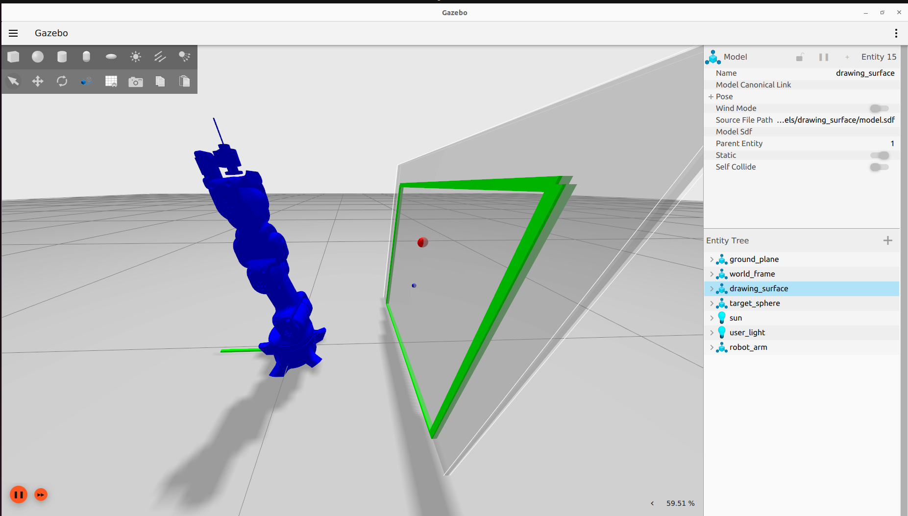

# 6-DOF Robot Arm Simulation - ROS2 Humble + Gazebo Fortress

A complete ROS2 workspace for simulating and controlling a 6-DOF robot arm in Gazebo Fortress with full joint control, end-effector tracking, and **reinforcement learning training system**.




## 📋 Table of Contents
- [Features](#features)
- [**RL Training System**](#-rl-training-system-new) ⭐
- [Prerequisites](#prerequisites)
- [Installation](#installation)
- [Quick Start](#quick-start)
- [Usage](#usage)
- [Project Structure](#project-structure)
- [Troubleshooting](#troubleshooting)

## ✨ Features

- ✅ **6-DOF Robot Arm** with full kinematics
- ✅ **Gazebo Fortress** integration with physics simulation
- ✅ **ros2_control** for position control of all joints
- ✅ **Python Control API** for manual joint control
- ✅ **End-Effector Tracking** using TF2
- ✅ **World Coordinate Frame** visualization (RGB axes)
- ✅ **Fast Movement** - 30 rad/s joint velocity
- ✅ **Dark Background** - easier on eyes
- ✅ **RViz2** visualization support
- ⭐ **RL Training System** - TD3 and SAC agents for autonomous learning

## 🤖 RL Training System (NEW)

### Overview
Complete reinforcement learning training system for teaching the robot arm to reach target positions autonomously.

**Key Features:**
- **Dual Agent Support**: TD3 (Twin Delayed DDPG) and SAC (Soft Actor-Critic)
- **6-DOF Inverse Kinematics**: Numerical IK solver utilizing all joints
- **Comprehensive Logging**: Per-step distance, EE position, joint angles, movement tracking
- **Training Statistics**: Auto-generated plots (rewards, success rate, losses) and CSV export
- **Replay Buffer Persistence**: Auto-save best/periodic/final buffers for training continuation
- **Interactive Menu**: Easy agent selection and configuration

### Technical Details

**State Space (23D):**
- 6 joint positions
- 6 joint velocities  
- 6 target joint positions
- 3 end-effector position (X, Y, Z)
- 2 target position (X, Z)

**Action Space (2D):**
- Target X position in workspace
- Target Z position in workspace

**Reward Function:**
- `-distance_to_target` (encourages minimization)
- Success bonus for reaching within 5mm

**IK Integration:**
- RL learns target positions → IK translates to joint angles
- Robot attempts movement even with IK errors < 200mm
- Typical IK errors: 20-40mm (acceptable for learning)

### Quick Start - RL Training

```bash
# Terminal 1: Launch Gazebo and ROS2 control
cd ~/new_rl_ros2/ros2_ws
source /opt/ros/humble/setup.bash
source install/setup.bash
ros2 launch robot_arm2 rl_training.launch.py

# Terminal 2: Start training
cd ~/new_rl_ros2/ros2_ws/src/robot_arm2/scripts
python3 train_robot.py
```

**Interactive Menu:**
1. Manual Test Mode
2. RL Training (TD3)
3. RL Training (SAC)

**Training Configuration:**
- Episodes: User-specified
- Max steps per episode: User-specified  
- Optional: Load existing replay buffer to continue training

### Training Results

Results are automatically saved to `scripts/training_results/YYYYMMDD_HHMMSS/`:

- **training_plot_*.png**: 4-subplot visualization
  - Episode rewards with cumulative average
  - Success rate with cumulative average
  - Actor loss
  - Critic loss
- **training_data_*.csv**: Episode-by-episode metrics
- **Models**: Best, periodic (every 25 episodes), and final checkpoints
- **Replay Buffers**: Saved with each model for training continuation

### Training Tips

1. **Start Small**: Begin with 100 episodes to verify setup
2. **Load Buffers**: Continue training by loading previous replay buffers
3. **Monitor IK**: Typical errors 20-40mm are acceptable
4. **Success Criteria**: Distance < 5mm to target
5. **Patience**: Success rates improve gradually over episodes

### Known Limitations

- Target sphere visual randomization on hold (Gazebo Fortress limitation)
- Training tracks correct internal target positions despite static visual sphere
- IK errors typically 20-40mm (acceptable for RL learning)


## 🔧 Prerequisites

### System Requirements
- **OS**: Ubuntu 22.04 LTS
- **ROS**: ROS2 Humble Hawksbill
- **Gazebo**: Gazebo Fortress 6.x
- **Python**: 3.10+

### Required Packages

```bash
# ROS2 Humble (full desktop installation)
sudo apt install ros-humble-desktop-full

# Gazebo Fortress and ROS2 integration
sudo apt install ros-humble-ros-gz ros-humble-gz-ros2-control

# ROS2 Control packages
sudo apt install ros-humble-ros2-control ros-humble-ros2-controllers

# Additional dependencies
sudo apt install python3-colcon-common-extensions
sudo apt install ros-humble-xacro
```

## 📦 Installation
cd ros2_ws
source /opt/ros/humble/setup.bash
colcon build --packages-select robot_arm2
```

### 3. Source the Workspace

```bash
source install/setup.bash
```

## 🚀 Quick Start

### Launch Gazebo Simulation

```bash
cd ~/new_rl_ros2/ros2_ws
source /opt/ros/humble/setup.bash
source install/setup.bash
export GZ_SIM_RESOURCE_PATH=$GZ_SIM_RESOURCE_PATH:$(ros2 pkg prefix robot_arm2)/share
ros2 launch robot_arm2 gazebo.launch.py
```

**What you'll see:**
- Gazebo Fortress window with dark background
- 6-DOF robot arm at origin
- RGB coordinate frame (Red=X, Green=Y, Blue=Z)
- Robot standing upright (fixed to ground)

### Control the Robot

**In a new terminal:**

```bash
cd ~/new_rl_ros2/ros2_ws
source /opt/ros/humble/setup.bash
source install/setup.bash
python3 install/robot_arm2/share/robot_arm2/scripts/control_robot.py
```

**Available commands:**
- `status` or `s` - Show current joint positions and end-effector location
- `home` or `h` - Move to home position [0,0,0,0,0,0]
- Enter 6 joint angles in degrees (e.g., `10 20 30 0 0 0`)
- Press Enter to exit

## 📖 Usage

### Manual Joint Control

The control script allows you to:
1. **Enter joint angles** in degrees for all 6 joints
2. **Track end-effector position** in real-time (X, Y, Z coordinates)
3. **Monitor joint states** (positions and velocities)

**Example session:**

```
Enter 6 joint angles (degrees) or command: status

======================================================================
🤖 ROBOT STATUS
======================================================================

📐 Joint Positions:
   Joint 1:    0.00° ( 0.0000 rad)
   Joint 2:    0.00° ( 0.0000 rad)
   Joint 3:    0.00° ( 0.0000 rad)
   Joint 4:    0.00° ( 0.0000 rad)
   Joint 5:    0.00° ( 0.0000 rad)
   Joint 6:    0.00° ( 0.0000 rad)

📍 End-Effector Position (End-effector_1):
   X:  0.1234 m
   Y:  0.0000 m
   Z:  0.2500 m
======================================================================

Enter 6 joint angles (degrees) or command: 10 20 30 0 0 0

🎯 Target: [ 10.  20.  30.   0.   0.   0.]°
⏳ Moving robot...
✅ Movement completed!

End-Effector Movement: 5.23 cm
  Before: [0.1234 0.0000 0.2500] m
  After:  [0.1456 0.0234 0.2678] m
```

### RViz2 Visualization

Launch RViz2 for visualization without physics:

```bash
cd ~/new_rl_ros2/ros2_ws
source /opt/ros/humble/setup.bash
source install/setup.bash
ros2 launch robot_arm2 display.launch.py
```

**In RViz2:**
1. Set **Fixed Frame** to `base_link`
2. Add **RobotModel** display
3. Use **Joint State Publisher GUI** to move joints with sliders

### Send Joint Commands via ROS2 Topic

You can also control the robot using ROS2 topics:

```bash
ros2 topic pub /arm_controller/joint_trajectory trajectory_msgs/msg/JointTrajectory "{
  joint_names: ['Joint 1', 'Joint 2', 'Joint 3', 'Joint 4', 'Joint 5', 'Joint 6'],
  points: [{
    positions: [0.5, 0.3, -0.2, 0.1, 0.0, 0.0],
    time_from_start: {sec: 1}
  }]
}" --once
```

## 📁 Project Structure

```
new_rl_ros2/
├── ros2_ws/                          # ROS2 workspace
│   └── src/
│       └── robot_arm2/               # Main robot package
│           ├── config/               # Controller configurations
│           │   └── controllers.yaml
│           ├── launch/               # Launch files
│           │   ├── gazebo.launch.py
│           │   └── display.launch.py
│           ├── meshes/               # STL mesh files (8 links)
│           ├── scripts/              # Python control scripts
│           │   └── control_robot.py
│           ├── urdf/                 # Robot description files
│           │   ├── New.xacro         # Main URDF
│           │   ├── robot_arm2.ros2_control.xacro
│           │   └── coordinate_frames.xacro
│           └── worlds/               # Gazebo world files
│               └── robot_world.sdf
└── rl_model_based/                   # Reference RL project (separate)
```

## 🔍 Robot Specifications

- **Joints**: 6 revolute joints
  - Joints 1, 2, 3, 5, 6: Continuous rotation (±180°)
  - Joint 4: Limited rotation (±90°)
- **Joint Velocity**: 30 rad/s (very fast movement)
- **Effort Limits**: 100 Nm per joint
- **Control Type**: Position control via JointTrajectoryController
- **End-Effector**: `End-effector_1` link (pen tip equivalent)

## 🐛 Troubleshooting

### Gazebo doesn't show the robot

**Solution:**
```bash
# Make sure to set the resource path before launching
export GZ_SIM_RESOURCE_PATH=$GZ_SIM_RESOURCE_PATH:$(ros2 pkg prefix robot_arm2)/share
```

### Controllers not loading

**Check controller status:**
```bash
ros2 control list_controllers
```

**Expected output:**
```
joint_state_broadcaster[joint_state_broadcaster/JointStateBroadcaster] active
arm_controller[joint_trajectory_controller/JointTrajectoryController] active
```

### Robot falls through ground

This should be fixed (world joint added), but if it happens:
- Check that `world_to_base` joint exists in URDF
- Rebuild: `colcon build --packages-select robot_arm2`

### End-effector position not available

**Wait for TF to initialize:**
```bash
# Check TF tree
ros2 run tf2_tools view_frames
```

The TF tree should show: `world → base_link → ... → End-effector_1`

## 📚 Additional Resources

- [ROS2 Humble Documentation](https://docs.ros.org/en/humble/)
- [Gazebo Fortress Documentation](https://gazebosim.org/docs/fortress)
- [ros2_control Documentation](https://control.ros.org/humble/index.html)

## 🤝 Contributing

Feel free to open issues or submit pull requests for improvements!

## 📝 License

This project is open source and available under the MIT License.

## 👤 Author

**ducanh** - [do010303](https://github.com/do010303)

---

**Happy Simulating! 🤖**
